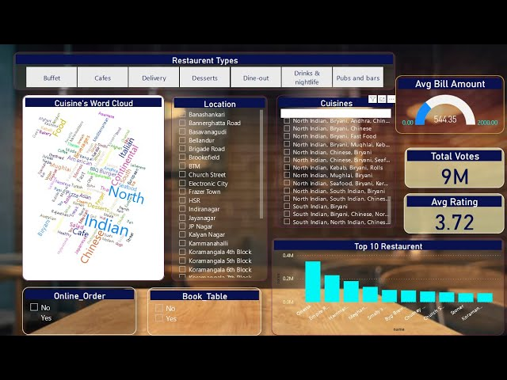

# Zomato Data Exploratory Data Analysis (EDA)

## Introduction
This repository contains my Exploratory Data Analysis (EDA) of the Zomato dataset from Kaggle. In this project, I've used Python along with libraries like Pandas, NumPy, and Matplotlib to explore and analyze the data.

## About the Dataset
The Zomato dataset is a comprehensive collection of restaurant data, including information about restaurants, their menus, locations, ratings, and more. It's a goldmine for foodies and data enthusiasts alike.

## EDA Highlights
During the analysis, I've performed various tasks, such as:

- Data Cleaning: Handling missing values and cleaning the dataset.
- Data Visualization: Creating informative plots and charts to visualize trends.
- Insights: Extracting meaningful insights about the restaurant industry.

## Prerequisites
To run the code in this repository, you'll need to have Python installed on your machine. You'll also need the following libraries:
- Pandas
- NumPy
- Matplotlib

You can install these libraries using the following command:
pip install pandas numpy matplotlib

## Usage
1. Clone this repository to your local machine.
2. Navigate to the project directory.
3. Run the Jupyter Notebook or Python script to perform the EDA.
4. Explore the findings and visualizations in the notebook or generated plots.

## Acknowledgments
- Kaggle for providing the Zomato dataset.

## License
This project is licensed under the MIT License - see the [LICENSE](LICENSE) file for details.

Feel free to explore the code and the insights gained from this analysis. If you have any questions or suggestions, please feel free to reach out.

Happy analyzing! 🍔📊
